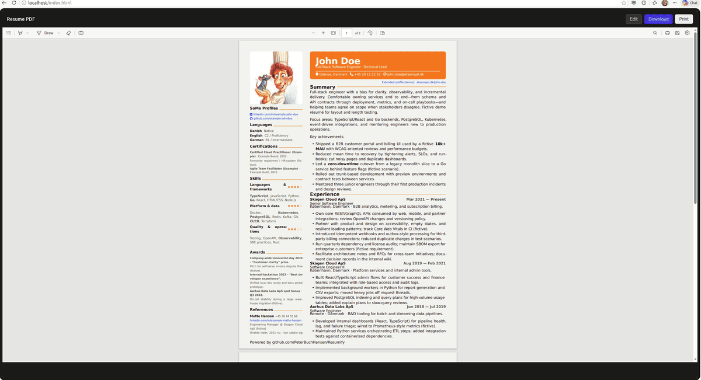

## License 
> **This project is licensed under the GNU General Public License v3.0 — see the [LICENSE](LICENSE) file for details.**<br>
> If you like this repository and want to use it yourself, **feel free to fork it**.<br>
> This allows you to keep up with upstream changes while maintaining your own version.<br>
> __You can customize the theme and content to suit your preferences and your Résumé,__<br>
> __make edits, and maintain your own Git history for your `models_vault`.__<br>
> **You can also use GitHub Pages to host your own CV.**<br>
><br>
> **Contributions are welcome! Feel free to open issues or submit pull requests.**

# Resumify

**Resumify** is a streamlined, containerized project for creating professional résumés with a web-based live editor and instant PDF preview. 
The structure is designed for simplicity—core layouts, content sections, and themes are neatly separated, so customizing your résumé is easy and flexible.
Your résumé becomes code: from a single source, you get both a polished PDF and a static website. 
Resumify makes sharing effortless, with built-in support for deployment to GitHub Pages or any static host—no backend required.

**Key Features & Responsibilities:**

- **Easy Sharing:** Effortlessly export your résumé as a static HTML page, perfect for hosting on GitHub Pages—no backend required.  
  Example: [View Resumify on GitHub Pages](https://peterbuchhansen.github.io/Resumify).

- **Clean Structure:** Keeps layouts, themes, main content, sidebar data, and assets in clearly separated files.

- **Live Editing:** Instantly update your résumé in a private, local web editor with live PDF preview as you type. 
  Accessible only on your machine for full control. See [Getting started](#getting-started) for setup and [editor demo](#see-editor-in-action) below.  
  When satisfied, just push your updates to share your latest version.

- **Extensible:** Easily extend your résumé by adding custom sections, themes, or layouts—just modify the Typst files or update the sidebar YAML to include new skills, links, or data fields as needed.

- **Containerized Dev Environment:** Develop and run Resumify inside a pre-configured Dev Container, with all tools and dependencies—like Typst and required fonts—installed for you. This ensures a consistent, hassle-free setup on any machine.


## See editor in action.

You can easily edit the résumé using the lightweight **local web editor** included with the project. It offers a live PDF preview for immediate feedback as you update your content. For sharing, a static **`index.html`** page is provided that displays the generated PDF. Both the editor and supporting tools are set up within the `.devcontainer` folder for a seamless development experience.




## Getting started

Get started quickly, customize easily, and share your résumé with confidence—all from a modern, organized workspace.

Without a vault, build from the repo root with **`typst compile models_demo/resume.typ resume.pdf`** (PDF at repo root). Optional encrypted vault under **`models_vault/`**: see [Data vault (optional)](#data-vault-optional).

### Option A — Dev Container (recommended)

- **Prerequisites:** **[VS Code](https://code.visualstudio.com/)** or **[Cursor](https://cursor.com/)** with the [Dev Containers](https://marketplace.visualstudio.com/items?itemName=ms-vscode-remote.remote-containers) extension, and a **Docker-compatible** container engine.

1. Clone the repo and open it in VS Code or Cursor.
2. Reopen in Dev Container (`Dev Containers: Reopen in Container`). The first-time setup may take a while.
3. Open **`http://localhost/editor.html`** (or the forwarded port **80**). The PDF updates live as you edit.

<a id="editor-server-restart"></a>

### If the editor server isn’t running (rare), or if you need to restart it:

Use the “Restart Editor Server” task from your editor’s task palette for the simplest restart.

- **Alternatives ways to start editor server:**  
  If the **task** is unavailable or not working, you can start the server manually with:
  ```bash
  bash controller/run-editor-server.sh
  ```
  Or, as another fallback, run the server directly with Cargo:
  ```bash
  cargo run --manifest-path controller/Cargo.toml -- .
  ```

### Option B — Local Setup (outside Dev Container)

- **Prerequisites:** Install [Typst](https://typst.app/), [Rust](https://rust-lang.org/), and [Cargo](https://doc.rust-lang.org/cargo/). You’ll also need the fonts required by your résumé theme. For the same set used in the dev image (such as Font Awesome 6 Free OTFs and Roboto Slab), check **`.devcontainer/Dockerfile`**.

1. Install anything missing from the list above.
2. Start the server from the repo root:
```bash
cargo run --manifest-path controller/Cargo.toml -- .
```
3. Open **`http://localhost/editor.html`** in your browser.

**Optional:** [Typst LSP](https://marketplace.visualstudio.com/items?itemName=nvarner.typst-lsp) and a PDF viewer extension.


## Data vault (optional)

**Behavior**

- No **`.passphrase`** at repo root → editor uses **`models_demo/`** only.
- With **`.passphrase`** (never commit) → editor uses plaintext under **`models_vault/`** (including **`resume.pdf`** there). Typst and the server do **not** touch **`*.enc`**; OpenSSL does. **`resume.pdf.enc`** is what you commit for the PDF when using the vault.

### First-time vault

1. Create repo-root **`.passphrase`** (never commit or share this file). From the repo root:

```bash
echo -n 'your-secret' > .passphrase && chmod 600 .passphrase
```

**Result:** Vault mode is on; **`init-models-from-demo.sh`** can run.

2. From the repo root:

```bash
bash scripts/init-models-from-demo.sh
```

**Result:** **`models_vault/`** is copied from **`models_demo/`**, **`models_vault/*.enc`** is written, and **`.githooks`** is wired up in a git checkout.

> **Warning — encrypting overwrites ciphertext**  
> **`encrypt-demo`**, **`encrypt-from`**, and **`init-models-from-demo.sh`** rewrite **`models_vault/*.enc`** and **remove `*.enc` files that have no matching 
plaintext**.  
> **Always backup or commit before running them if you care about the current vault.**

3. [Restart the editor server](#editor-server-restart) if it was already running.  
   **Result:** The server reads plaintext from **`models_vault/`**.

### After clone (when you know the vault passphrase)

Use this when the repo has **`models_vault/*.enc`** but little or no plaintext (typical right after **`git clone`**).

1. Add the same secret the vault was encrypted with (never commit **`.passphrase`**). Or use **`PASSFILE`** — see **`scripts/vault-crypto.sh`**.

```bash
echo -n 'your-secret' > .passphrase && chmod 600 .passphrase
```

**Result:** OpenSSL can decrypt the vault.

2. From the repo root (needs OpenSSL):

```bash
bash scripts/vault-decode-all.sh
```

[Restart the editor server](#editor-server-restart) afterward if needed.  
**Result:** Plaintext sits next to **`*.enc`** under **`models_vault/`**; the editor can open it.

### Commit or save your vault files to git

1. Use **`git commit`** as usual with **`.githooks/pre-commit`** (after **`init-models-from-demo.sh`**). If hooks were never installed:

```bash
bash scripts/install-git-hooks.sh
```

**Result:** When plaintext and **`*.enc`** are out of sync, **`encrypt-from`** runs and **`models_vault/`** is re-staged. Needs OpenSSL where you commit.

2. Or refresh ciphertext yourself, then stage:

```bash
bash scripts/vault-crypto.sh encrypt-from models_vault
git add models_vault/
```

**Result:** **`*.enc`** matches what is on disk before you commit.

**Scripts:** **`vault-decode-all.sh`** (decrypt all) · **`vault-crypto.sh`** (encrypt/decrypt helpers; see top of file for commands) · **`install-git-hooks.sh`** (hooks only — usually covered by init).
